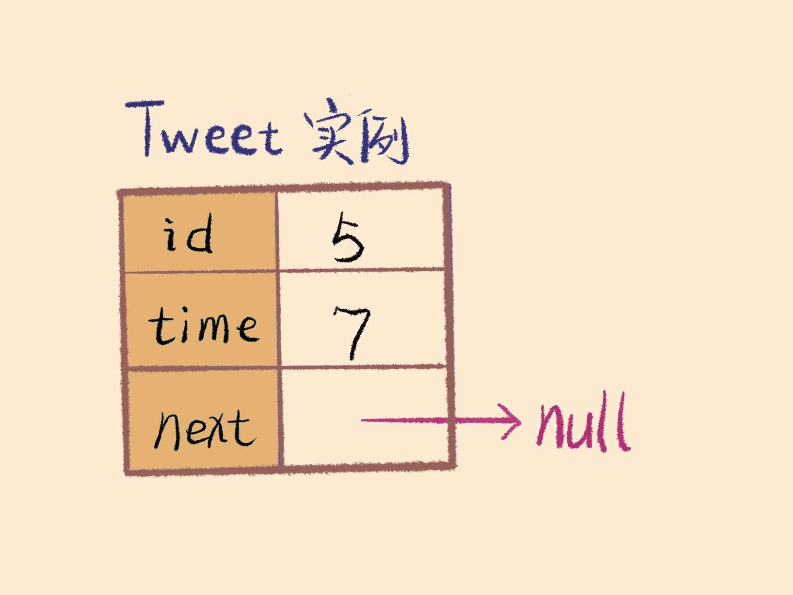

### [355\. 设计推特](https://leetcode-cn.com/problems/design-twitter/)

Difficulty: **中等**


设计一个简化版的推特(Twitter)，可以让用户实现发送推文，关注/取消关注其他用户，能够看见关注人（包括自己）的最近十条推文。你的设计需要支持以下的几个功能：

1.  **postTweet(userId, tweetId)**: 创建一条新的推文
2.  **getNewsFeed(userId)**: 检索最近的十条推文。每个推文都必须是由此用户关注的人或者是用户自己发出的。推文必须按照时间顺序由最近的开始排序。
3.  **follow(followerId, followeeId)**: 关注一个用户
4.  **unfollow(followerId, followeeId)**: 取消关注一个用户

**示例:**

```
Twitter twitter = new Twitter();

// 用户1发送了一条新推文 (用户id = 1, 推文id = 5).
twitter.postTweet(1, 5);

// 用户1的获取推文应当返回一个列表，其中包含一个id为5的推文.
twitter.getNewsFeed(1);

// 用户1关注了用户2.
twitter.follow(1, 2);

// 用户2发送了一个新推文 (推文id = 6).
twitter.postTweet(2, 6);

// 用户1的获取推文应当返回一个列表，其中包含两个推文，id分别为 -> [6, 5].
// 推文id6应当在推文id5之前，因为它是在5之后发送的.
twitter.getNewsFeed(1);

// 用户1取消关注了用户2.
twitter.unfollow(1, 2);

// 用户1的获取推文应当返回一个列表，其中包含一个id为5的推文.
// 因为用户1已经不再关注用户2.
twitter.getNewsFeed(1);
```


#### Solution

未通过编译。
分为`Tweet`类,`user`类,合并 `k` 个有序链表合并思想见`getNewsFeed`，使用优先队列，比较`time`。`time`越大说明越近。



```cpp
​static int timeStamp = 0;

class tweet{
public:
    int tweetId;
    int time;
    tweet *next;
    tweet(int id, int t){
        this->tweetId = id;
        this->time = t;
        this->next = nullptr;
    }
};
struct cmp1{
    bool operator()(tweet* a, tweet* b){
        return a->time < b->time;
    }
};

class user{
private:
    int userId;
public:
    unordered_set<int> followedId;
    tweet *head;
    user(int id){
        this->userId = id;
        this->head = nullptr;
        followedId.insert(id);
    }

    void followId(int id){
        followedId.insert(id);
        return;
    }
    void unFollowId(int id){
        if(id!=userId){
            followedId.erase(id);
        }
        return;
    }
    void postT(int tId){
        tweet* newT = new tweet(tId, timeStamp);
        timeStamp++;
        newT->next = head;
        head = newT;
        return;
    }
};


class Twitter {
private:
    unordered_map<int, user> userMap;
public:
    /** Initialize your data structure here. */
    Twitter() {
    }
    
    /** Compose a new tweet. */
    void postTweet(int userId, int tweetId) {
        if(userMap.find(userId)==userMap.end()){
            user *uTemp = new user(userId);
            userMap.insert(pair<int, user>(userId, *uTemp));
        }
        user u = userMap[userId];
        u.postT(tweetId);
        return;
    }
    
    /** Retrieve the 10 most recent tweet ids in the user's news feed. Each item in the news feed must be posted by users who the user followed or by the user herself. Tweets must be ordered from most recent to least recent. */
    vector<int> getNewsFeed(int userId) {
        priority_queue <tweet* ,vector<tweet*>, cmp1> pq;
        vector<int> res;
        if(userMap.find(userId)==userMap.end()){
            return res;
        }
        unordered_set<int> users = userMap[userId].followedId;
        for(int us : users){
            tweet* twt = userMap[userId].head;
            if (twt == nullptr){
                continue;
            }
            pq.emplace(twt);
        }
        while(!pq.empty()){
            if(res.size()==10){
                break;
            }
            tweet *twtTemp = pq.top();
            pq.pop();
            res.emplace_back(twtTemp->tweetId);
            if(twtTemp->next!=nullptr){
                pq.emplace(twtTemp->next);
            }
        }
        return res;
    }
    
    /** Follower follows a followee. If the operation is invalid, it should be a no-op. */
    void follow(int followerId, int followeeId) {
        if(userMap.find(followerId)==userMap.end()){
            user *uTemp = new user(followerId);
            userMap.insert(pair<int, user>(followerId, *uTemp));
        }
        if(userMap.find(followeeId)==userMap.end()){
            user *uTemp2 = new user(followeeId);
            userMap.insert(pair<int, user>(followeeId, *uTemp2));
        }
        user u = userMap[followerId];
        u.followId(followeeId);
        return;
    }
    
    /** Follower unfollows a followee. If the operation is invalid, it should be a no-op. */
    void unfollow(int followerId, int followeeId) {
        if(userMap.find(followerId)==userMap.end()){
            user *uTemp = new user(followerId);
            userMap.insert(pair<int, user>(followerId, *uTemp));
        }
        user u = userMap[followerId];
        u.unFollowId(followeeId);
        return;
    }
};

/**
 * Your Twitter object will be instantiated and called as such:
 * Twitter* obj = new Twitter();
 * obj->postTweet(userId,tweetId);
 * vector<int> param_2 = obj->getNewsFeed(userId);
 * obj->follow(followerId,followeeId);
 * obj->unfollow(followerId,followeeId);
 */
```