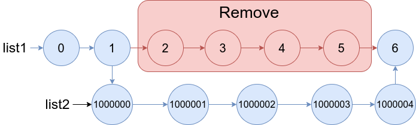

# 1669. 合并两个链表：  
**题目地址：**[LeetCode](https://leetcode-cn.com/problems/merge-in-between-linked-lists/)  
**题目描述：**   
给你两个链表 `list1` 和 `list2` ，它们包含的元素分别为 `n` 个和 `m` 个。  

请你将 `list1` 中第 `a` 个节点到第 `b` 个节点删除，并将 `list2` 接在被删除节点的位置。  

下图中蓝色边和节点展示了操作后的结果：  
  
请你返回结果链表的头指针。

**示例1：**  
  
```
输入：list1 = [0,1,2,3,4,5], a = 3, b = 4, list2 = [1000000,1000001,1000002]
输出：[0,1,2,1000000,1000001,1000002,5]
解释：我们删除 list1 中第三和第四个节点，并将 list2 接在该位置。上图中蓝色的边和节点为答案链表。
```

**示例2：**  
  
```
输入：list1 = [0,1,2,3,4,5,6], a = 2, b = 5, list2 = [1000000,1000001,1000002,1000003,1000004]
输出：[0,1,1000000,1000001,1000002,1000003,1000004,6]
解释：上图中蓝色的边和节点为答案链表。
```

## 自解：
思路：将a-1的next指向list2；list2的m-1指向b+1  
思路差不多，实现导致时间不同。
```cpp
/**
 * Definition for singly-linked list.
 * struct ListNode {
 *     int val;
 *     ListNode *next;
 *     ListNode() : val(0), next(nullptr) {}
 *     ListNode(int x) : val(x), next(nullptr) {}
 *     ListNode(int x, ListNode *next) : val(x), next(next) {}
 * };
 */
class Solution {
public:
    ListNode* mergeInBetween(ListNode* list1, int a, int b, ListNode* list2) {
        int k = b-a;
        ListNode *ptr1 = list1;
        for(int i=0; i<a-1; i++){ // 移动到a-1
            ptr1 = ptr1->next;
        }
        ListNode *ptr2 = ptr1->next;
        ptr1->next = list2;
        for(int i=0; i<=k; i++){
            ptr2 = ptr2->next;
        }
        while(list2->next != NULL){
            list2 = list2->next;
        }
        list2->next = ptr2;
        return list1;
    }
};
```
