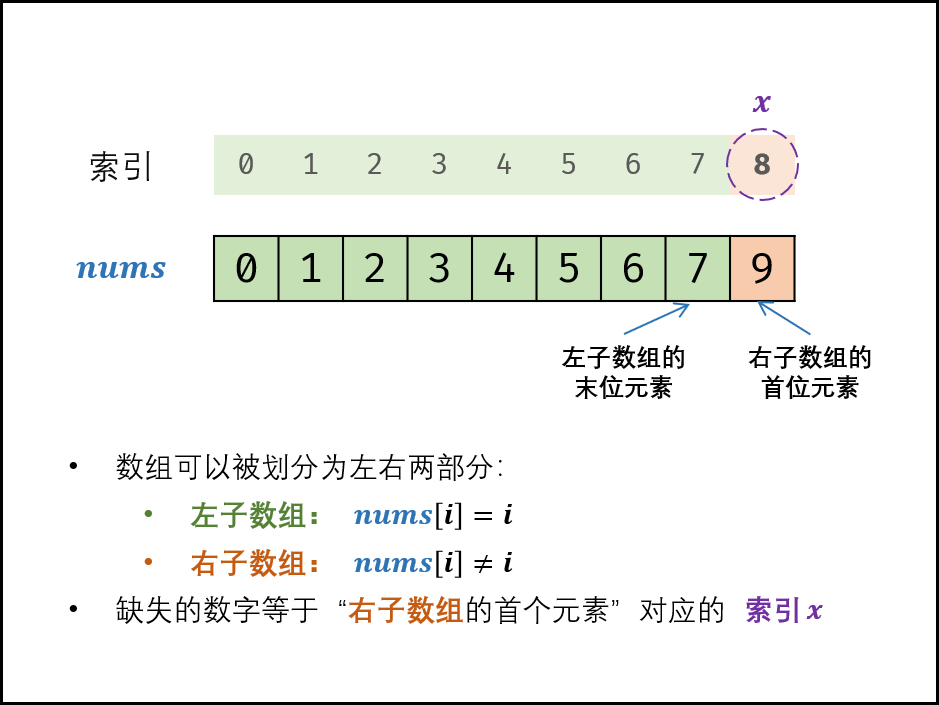

# 剑指Offer53II. 0~n-1中缺失的数字：  
**题目地址：**[LeetCode](https://leetcode-cn.com/problems/er-cha-sou-suo-shu-de-di-kda-jie-dian-lcof/)  
**题目描述：**  
一个长度为n-1的递增排序数组中的所有数字都是唯一的，并且每个数字都在范围0～n-1之内。在范围0～n-1内的n个数字中有且只有一个数字不在该数组中，请找出这个数字。

**示例：**  
```
输入: [0,1,3]
输出: 2
输入: [0,1]
输出: 2
输入: [1]
输出: 0
输入: [0]
输出: 1
```

## 思路：  

时间复杂度 O(log N)： 二分法为对数级别复杂度。
注意，中点向下取整
```cpp
class Solution {
public:
    int missingNumber(vector<int>& nums) {
        int left = 0;
        int right = nums.size();
        int point;
        while(right>left){
            point = (right+left)/2;
            if(nums[point]==point){
                left = point + 1;
            } else{
                right = point;
            }
        }
    return left;
    }
};
```