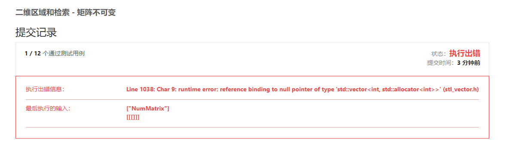

# 304.二维区域和检索：  
**题目地址：**[LeetCode](https://leetcode-cn.com/problems/range-sum-query-2d-immutable/)  
**题目描述：**  
给定一个二维矩阵，计算其子矩形范围内元素的总和，该子矩阵的左上角为 (row1, col1) ，右下角为 (row2, col2) 。  

  
上图子矩阵左上角 (row1, col1) = (2, 1) ，右下角(row2, col2) = (4, 3)，该子矩形内元素的总和为 8。  

## 初次代码——一维前缀和:  
```cpp
class NumMatrix {
public:
    vector<vector<int>> sumsMatrix;

    NumMatrix(vector<vector<int>>& matrix) {
        int row = matrix.size(); //行
        if(row>0){
            int col = matrix[0].size(); //列
            sumsMatrix.resize(row+1, vector<int>(col));
            for(int i=0; i<row; i++){
            for(int j=0; j<col; j++){
                sumsMatrix[i+1][j] = sumsMatrix[i][j] + matrix[i][j];
            }
        }
        }
    }
    
    int sumRegion(int row1, int col1, int row2, int col2) {
        int sum = 0;
        for(int i=col1; i<=col2; i++){
            sum += sumsMatrix[row2+1][i] - sumsMatrix[row1][i];
        }
        return sum;
    }
};
```
思路：一维前缀和，然后每列相加  
提交错误:  
  
未考虑空用例的情况
```cpp
class NumMatrix {
public:
    vector<vector<int>> sumsMatrix;

    NumMatrix(vector<vector<int>>& matrix) {
        int row = matrix.size(); //行
        int col = matrix[0].size(); //列
        sumsMatrix.resize(row+1, vector<int>(col));

        for(int i=0; i<row; i++){
            for(int j=0; j<col; j++){
                sumsMatrix[i+1][j] = sumsMatrix[i][j] + matrix[i][j];
            }
        }
    }
    
    int sumRegion(int row1, int col1, int row2, int col2) {
        int sum = 0;
        for(int i=col1; i<=col2; i++){
            sum += sumsMatrix[row2+1][i] - sumsMatrix[row1][i];
        }
        return sum;
    }
};
```

## 代码——优化：二维前缀和  
### 官方版本：  
``` cpp
class NumMatrix {
public:
    vector<vector<int>> sums;

    NumMatrix(vector<vector<int>>& matrix) {
        int m = matrix.size();
        if (m > 0) {
            int n = matrix[0].size();
            sums.resize(m + 1, vector<int>(n + 1));
            for (int i = 0; i < m; i++) {
                for (int j = 0; j < n; j++) {
                    sums[i + 1][j + 1] = sums[i][j + 1] + sums[i + 1][j] - sums[i][j] + matrix[i][j];
                }
            }
        }
    }

    int sumRegion(int row1, int col1, int row2, int col2) {
        return sums[row2 + 1][col2 + 1] - sums[row1][col2 + 1] - sums[row2 + 1][col1] + sums[row1][col1];
    }
};
```
作者：LeetCode-Solution
链接：https://leetcode-cn.com/problems/range-sum-query-2d-immutable/solution/er-wei-qu-yu-he-jian-suo-ju-zhen-bu-ke-b-2z5n/
来源：力扣（LeetCode）
著作权归作者所有。商业转载请联系作者获得授权，非商业转载请注明出处。  

思路：  
1.二维前缀和：$f(x,y)$，为$(x,y)$左上方所有点的值的和(左上方为$(0,0)$)  
2.二位前缀和求法:$f(x,y)=f(i−1,j)+f(i,j−1)−f(i−1,j−1)+matrix[i][j]$  
3.sumRegion求法：$sumRegion(row1,col1,row2,col2)=sums[row2 + 1][col2 + 1] - sums[row1][col2 + 1] - sums[row2 + 1][col1] + sums[row1][col1]$