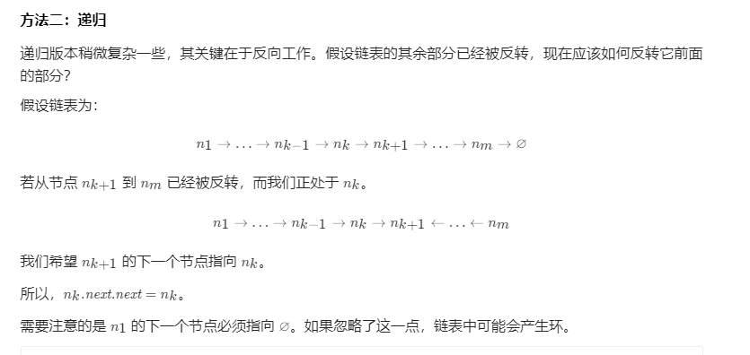

# 剑指Offer24. 反转链表：  
**题目地址：**[LeetCode](https://leetcode-cn.com/problems/fan-zhuan-lian-biao-lcof/)   
**题目描述：**   
定义一个函数，输入一个链表的头节点，反转该链表并输出反转后链表的头节点。  

**示例：**  
```
输入: 1->2->3->4->5->NULL
输出: 5->4->3->2->1->NULL
```

## 自解：
```cpp
class Solution {
public:
    ListNode* reverseList(ListNode* head) {
        if(head==NULL){
            return head;
        }
        vector<ListNode*> s;
        while(head!=NULL){
            s.push_back(head);
            head = head->next;
        }
        ListNode *head2 = s.back();
        s.pop_back();
        ListNode *ptr = head2;
        while(! s.empty()){
            ptr->next = s.back();
            s.pop_back();
            ptr = ptr->next;
        }
        ptr->next = NULL;
        return head2;
    }
};
```
## 双指针：
* 定义两个指针： prepre 和 curcur ；prepre 在前 curcur 在后。  
* 每次让 prepre 的 nextnext 指向 curcur ，实现一次局部反转  
* 局部反转完成之后， prepre 和 curcur 同时往前移动一个位置  
* 循环上述过程，直至 prepre 到达链表尾部  

```cpp
class Solution {
public:
    ListNode* reverseList(ListNode* head) {
        ListNode* cur = NULL, *pre = head;
        while (pre != NULL) {
            ListNode* t = pre->next;
            pre->next = cur;
            cur = pre;
            pre = t;
        }
        return cur;
    }
};
```

## 递归：
* 使用递归函数，一直递归到链表的最后一个结点，该结点就是反转后的头结点，记作 retret .  
* 此后，每次函数在返回的过程中，让当前结点的下一个结点的 nextnext 指针指向当前节点。  
* 同时让当前结点的 nextnext 指针指向 NULLNULL ，从而实现从链表尾部开始的局部反转  
* 当递归函数全部出栈后，链表反转完成。  

```cpp
class Solution {
public:
    ListNode* reverseList(ListNode* head) {
        if (head == NULL || head->next == NULL) {
            return head;
        }
        ListNode* ret = reverseList(head->next);
        head->next->next = head;
        head->next = NULL;
        return ret;
    }
};
```


理解递归思路：  
1.所有的递归问题都可以用递推公式来表示。有了这个递推公式，我们就可以很轻松地将它改为递归代码，遇到递归不要怕，先想**递推公式**。  

**Eg. 1** 问题：斐波那契数列的第n项  
递推公式：  
```cpp
f(n)=f(n-1)+f(n-2) 其中，f(0)=0,f(1)=1
```
终止条件：  
```cpp
if (n <= 2) return 1;
```
递归代码：  
```cpp
int f(int n) {
  if (n <= 2) return 1;
  return f(n-1) + f(n-2);
}
```  
**Eg. 2** 问题：逆序打印一个数组  
递推公式：  
```cpp
假设令F(n)=逆序遍历长度为n的数组
那么F(n)= 打印数组中下标为n的元素 + F(n-1)
```
终止条件：  
```cpp
if (n <0) return ;
```
递归代码：
```cpp
public void Print(int[] nums,int n){
    if(n<0) return;
    System.out.println(nums[n]);
    Print(nums,n-1);
}
```
到这里，不知道大家对写递归有没有一些理解了。其实写递归不能总想着去把递归平铺展开，这样脑子里就会循环，一层一层往下调，然后再一层一层返回，试图想搞清楚计算机每一步都是怎么执行的，这样就很容易被绕进去。对于递归代码，这种试图想清楚整个递和归过程的做法，实际上是进入了一个思维误区。只要找到**递推公式**，我们就能很轻松地写出递归代码。

Note:
终止条件放前面，递推公式放后面。

**Eg. 3** 问题：单向链表的反转  
递推公式：
```cpp
令F(node)为问题:反转以node为头节点的单向链表；
一般，我们需要考虑F(n)和F(n-1)的关系，那么这里，如果n代表以node为头节点的单向链表，那么n-1就代表以node.next为头节点的单向链表.
所以，我们令F(node.next)为问题：反转以node.next为头节点的单向链表；
那么，F(node)和F(node.next)之间的关系是？这里我们来简单画个图，假设我们反转3个节点的链表：
1 -> 2 -> 3
那么，F(node=1)=F(node=2)+?
这里假设子问题F(node=2)已经解决，那么我们如何解决F(node=1)：
很明显，我们需要反转node=2和node=1， 即 node.next.next=node; 同时 node.next=null;
所以，这个问题就可以是：F(node=1)=F(node=2)+ 反转node=2和node=1


public ListNode reverseList(ListNode head) {
        if(head == null || head.next == null) {  //终止条件并不难想
            return head;
        }
        ListNode node = reverseList(head.next);
        head.next.next = head;
        head.next = null;
        return node;  //按上面的例子，F(node=1)和F(node=2)它俩反转后的头节点是同一个
    }
```