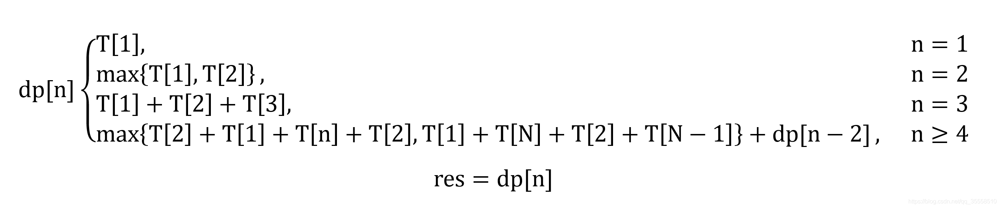

```
在漆黑的夜里，N位旅行者来到了一座狭窄而且没有护栏的桥边。如果不借助手电筒的话，大家是无论如何也不敢过桥去的。不幸的是，N个人一共只带了一只手电筒，而桥窄得只够让两个人同时过。如果各自单独过桥的话，N人所需要的时间已知；而如果两人同时过桥，所需要的时间就是走得比较慢的那个人单独行动时所需的时间。问题是，如何设计一个方案，让这N人尽快过桥。假设N <= 1000。
```

将N个旅行者的过桥时间按递增排序，记为数组 T 。有下面两种方法。  
    1.每次最快和最慢的过去，最快的回来  
        这是希望最快速度送回来。  
    2.最快和次快的人先过去，最快的人回来，最慢和次慢的人过去，次快的人回来  
        这是希望一次过最慢的俩，利用率高，而不是桥上最快的一直等最慢的。  

由此我们便可以得到递推关系式，dp[n]指前较快的N个旅行者过桥的最少时间  
